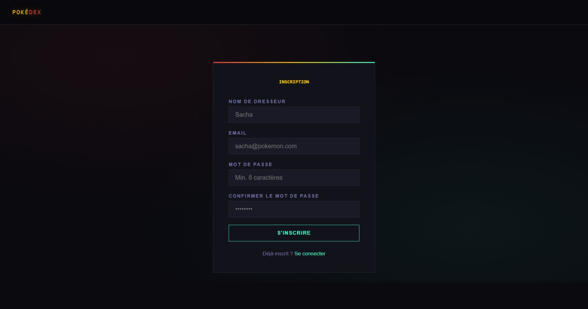
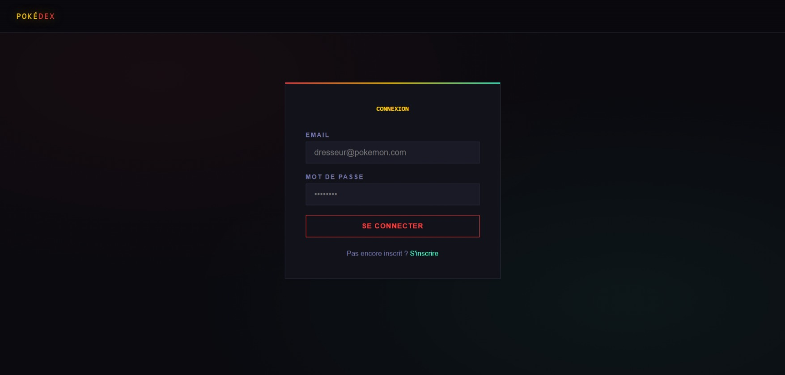
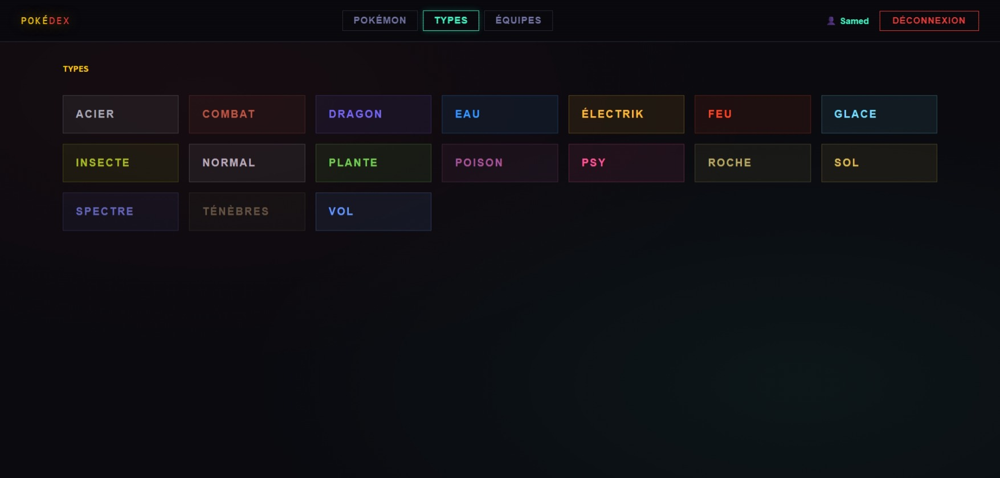
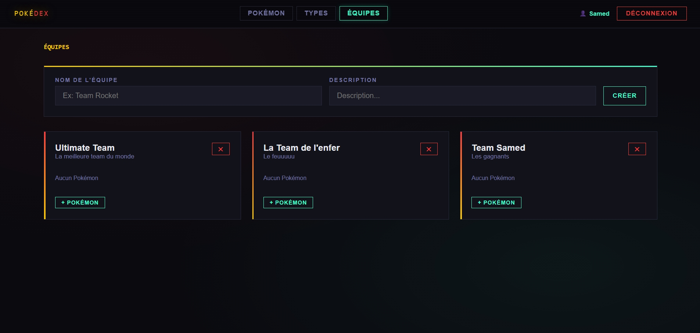
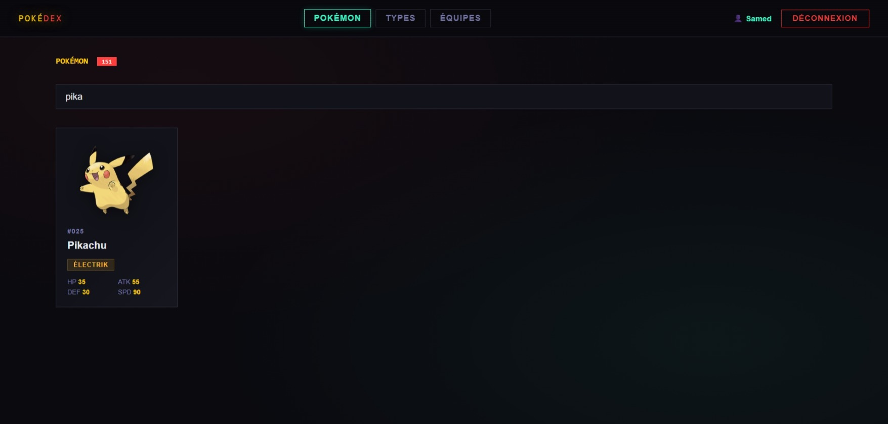
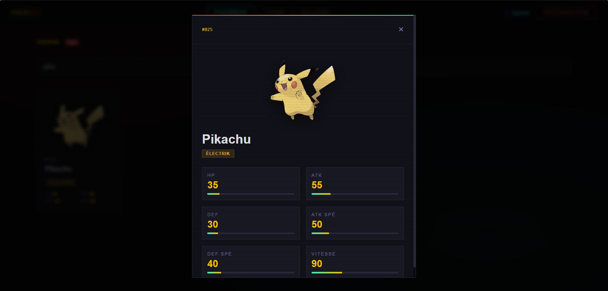

# Pokédex Fullstack

Projet Pokedex : backend et frontend pour lister les 151 Pokémon.  
Permet la recherche, l’affichage et la navigation des Pokémon via une API personnalisée.

## Fonctionnalités principales

- Lister les 151 Pokémon avec leurs informations principales (type, stats, image)  
- Recherche par nom ou type  
- Navigation et pagination  
- Gestion des équipes de Pokémon (ajout, suppression, renommage)  

## Technologies utilisées

- **Frontend** : HTML, CSS, JavaScript  
- **Backend** : Node.js, Express  
- **Base de données** : PostgreSQL avec Sequelize  
- **API** : Endpoints REST pour récupérer et modifier les données Pokémon  
- **Outils** : RestClient pour tester l’API  

## Installation et lancement

1. Cloner le repo :  
```bash
git clone https://github.com/TONPSEUDO/pokedex.git
cd pokedex # Pour se placer dans le projet
```

2. Installer les dépendances pour le backend :
```bash  
cd api
npm install # Pour installer les dépendances
npm run dev # Pour lancer le serveur
```

3. Installer les dépendances pour le frontend :  
```bash
cd ../client
npm install # Pour installer les dépendances
npm run dev # Pour lancer le serveur
```

## Accès au projet

⚠️ Ce projet tourne uniquement sur la VM Cloud de la formation.  
Il n’est pas directement accessible depuis un navigateur local.  

Pour visualiser le Pokédex et ses fonctionnalités, voici quelques captures d’écran :

***Page d'inscription***


***Page de connexion***


***Page de tous les Pokemons***


***Page type de Pokemon***


***Page des équipes***


***Recherche de Pokemon***


***Détail d'un Pokemon***
